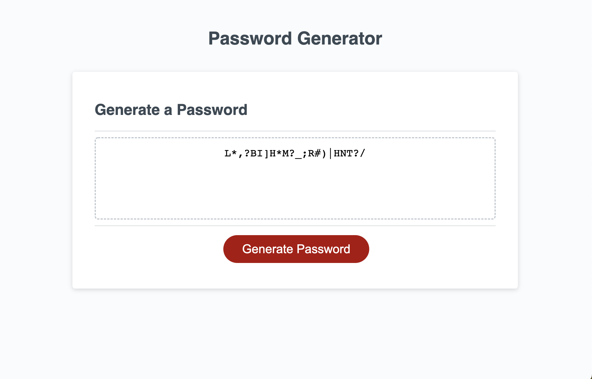

# Project Name - Customizable Password Generator

## Table of contents

- [Overview](#overview)
  - [The challenge](#the-challenge)
  - [User Story](#user-story)
  - [Acceptance Criteria](#acceptance-criteria)
  - [Screenshot](#screenshot)
  - [Links](#links)
- [My process](#my-process)
  - [Built with](#built-with)
  - [What I learned](#what-i-learned)
  - [Continued development](#continued-development)
  - [Useful resources](#useful-resources)
- [Author](#author)
- [Acknowledgments](#acknowledgments)


## Overview
The Customizable Password Generator is an app that generates a random password based on criteria the user has selected. 

### The challenge

The Customizable Password Generator runs in the browser, and features dynamically updated HTML and CSS powered by JavaScript. The Generator has a clean and polished user interface that is responsive, ensuring that it adapts to multiple screen sizes.

### User Story

AS AN employee with access to sensitive data
I WANT to randomly generate a password that meets certain criteria
SO THAT I can create a strong password that provides greater security

### Acceptance Criteria

GIVEN I need a new, secure password
WHEN I click the button to generate a password
THEN I am presented with a series of prompts for password criteria
WHEN prompted for password criteria
THEN I select which criteria to include in the password
WHEN prompted for the length of the password
THEN I choose a length of at least 8 characters and no more than 128 characters
WHEN asked for character types to include in the password
THEN I confirm whether or not to include lowercase, uppercase, numeric, and/or special characters
WHEN I answer each prompt
THEN my input should be validated and at least one character type should be selected
WHEN all prompts are answered
THEN a password is generated that matches the selected criteria
WHEN the password is generated
THEN the password is either displayed in an alert or written to the page

### Screenshot




### Links

- Solution URL: [GitHub Repository](https://github.com/NiferK/Customizable-Password-Generator-h3)
- Live Site URL: [Customizable Password Generator](https://niferk.github.io/Customizable-Password-Generator-h3/)


## My process


This JS task seemed insumountable to me at first. The terminology, syntax, and overall construction of how the various moving parts interconnected with each other was quite confusing for me. This is how I approached the problem:

I first broke the problem down into smaller sections of code, not worrying about what I needed to do next. I focused on first making the dialog boxes work, and subsequently create the output that I would use in the actual generation of the password. This included both ensuring that I was getting the results that I wanted with the happy path, as well as edge cases. 

Once that was nailed down, I refactored it, because although the dialog boxes were working in isolation, they were really, really WET.

Next, I researched of how to create a function that would ranomly make a string using specific input. I further broke this up into to smaller pieces: One function to create a string of characters, depending on the users input, the second function to randomly select a character from that string, until the maximum characters were met.

I got to a point where all these functions were working independently, but now it was time to put it all together. I entertained the idea of putting all of the code under one function, however I felt that keeping these functions separate, and merely calling upon them in other functions, would keep the code easier to test, easier to understand, and easier to maintain and reuse.


### Built with

- Semantic HTML5 markup
- CSS
- Javascript

### What I learned

Putting all of the isolated blocks of code together into one working function was my greatest area of learning. 

One of my biggest learnings was that I didn't need to create global varitables outside of the functions, to call upon them in other functions, but rather, other functions could call upon those variables by stating them as arguments in that function. 

For example, here I call upon the variables useLower, useUppercase, useNumbers, useSpecialChar which were declared locally in another function:

```js
function createChosenCharString(useLower, useUppercase, useNumbers, useSpecialChars) {
  let chosenCharString = "";
  const alphaLower = "abcdefghijklmnopqrstuvwxyz";
  const alphaUpper = "ABCDEFGHIJKLMNOPQRSTUVWXYZ";
  const numbers = "0123456789";
  const allSpecialChars = "~!@#$%^&*()_+-={}|[];<>?,./";
  if (useLower) {
    chosenCharString = alphaLower.concat(chosenCharString);
  }
  if (useUppercase) {
    chosenCharString = alphaUpper.concat(chosenCharString);
  }
  if (useNumbers) {
    chosenCharString = numbers.concat(chosenCharString);
  }
  if (useSpecialChars) {
    chosenCharString = allSpecialChars.concat(chosenCharString);
  }
  return chosenCharString;
}
```
And again, here I called upon the variable that is located int the above function:

```js
function createPassword(length, chosenCharString) {
```

And of course, I also learned that the order of the arguments matter.

### Continued development

Moving forward in javascript, I will continue to focus on syntax, as that is an area that I still need to more fully understand.

### Useful resources

Selecting random characters for a password involves using built-in math mathods that first need to be understood before attempting to implement. I found the following resources useful in creating the actual code that would create the random string:

- [MDN, Math.random](https://developer.mozilla.org/en-US/docs/Web/JavaScript/Reference/Global_Objects/Math/random)
- [W3 Collective on generating random string for a password](https://w3collective.com/random-password-generator-javascript/)
- [Dev Community on Random Password Generator](https://dev.to/code_mystery/random-password-generator-using-javascript-6a)

## Author

- GitHub - [NiferK](https://github.com/NiferK)
- Portfolio - [Nifer Kilakila](https://niferk.github.io/Nifer-Kilakila-Portfolio-h2/)


## Acknowledgments

Big shout out to my TA from Berkeley Coding Bootcamp, Luigi. He spent a good part of his Friday afternoon, helping me understand Javascript syntax, and gave some awesome feedback with refactoring my code.  Also a huge shout out to [nullaus](https://github.com/nullaus) who was my quick dial on all the random questions about JS, and taught me that the arguments of functions could call on variables inside of other functions.